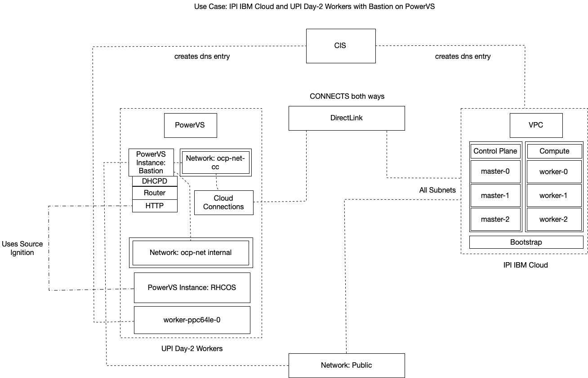

# ocp4-upi-compute-power

The `ocp4-upi-compute-power` [project](https://github.com/prb112/ocp4-upi-compute-power) provides Terraform based automation code to help with the deployment of OpenShift Container Platform (OCP) 4.x compute workers on [IBM® Power Systems™ Virtual Server on IBM Cloud](https://www.ibm.com/cloud/power-virtual-server).

## Prerequisites

1. Requires Terraform v1.4.0 or Higher
2. A PowerVS Service
3. An RHCOS Image loaded to the PowerVS Service
4. An Existing OpenShift Container Platform Cluster (on Power or Intel VPC)
5. A downloaded ignition file stored (in data folder)

```
❯ curl -k http://api.demo.ocp-power.xyz:22624/config/worker -o worker.ign
```

or

```
❯ oc extract -n openshift-machine-api secret/worker-user-data --keys=userData --to=-
```

# Development 
The code is built with Terraform and may in the future include Ansible and Shell scripts.

## Architecture

This architecture augments an existing IBM VPC hosted Red Hat OpenShift Container Platform cluster with IBM PowerVS hosted workers. The approach uses the ignition file from the existing cluster in order to boot Red Hat CoreOS with the cluster's MachineConfigPool `worker`.

This architecture only adds compute plane workers.



## Dependencies: Providers

The automation code uses the following providers:

1. [ibm-cloud/ibm](https://registry.terraform.io/providers/IBM-Cloud/ibm/latest/docs) to deploy a work on a Power Systems Virtual Server Instance.
2. [hashicorp/random](https://registry.terraform.io/providers/hashicorp/random/latest/docs) sets a random id for the 
3. [hashicorp/null](https://registry.terraform.io/providers/hashicorp/null/latest/docs) we may use this in the future to sign the CSR on the bastion
4. [community-terraform-providers/ignition](https://registry.terraform.io/providers/community-terraform-providers/ignition/latest/docs) [git](https://github.com/community-terraform-providers/terraform-provider-ignition)


